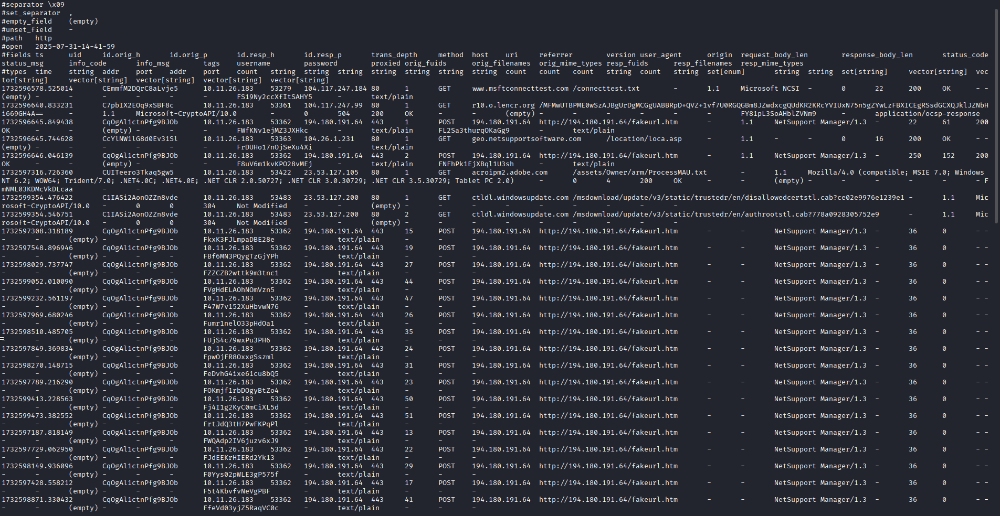
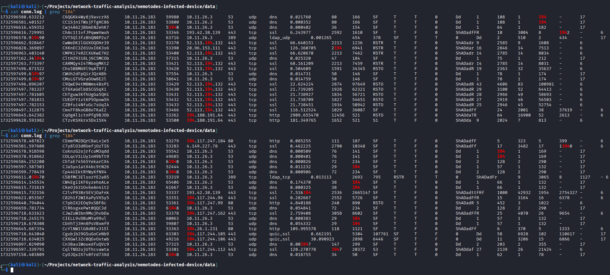

-- --
### Network Forensic Analysis of Suspected Malware

|Case ID|Report Title|Date of Report|Author|
|---|---|---|---|
|BMT10000 2|Network Forensic Analysis of Suspected Malware|July 31, 2025|Andrew McKenzie|

Export to Sheets

---

### 1. Executive Summary

On July 31, 2025, a network traffic analysis of a captured PCAP file (`2024-11-26-traffic-analysis-exercise.pcap`) identified suspicious network activity originating from the host at **10.11.26.183**. The activity points towards a potential remote access trojan (RAT) or info-stealer infection. The host was observed making numerous connections to a known remote access server at **194.180.191.64** over HTTP on port 443, a non-standard port for this protocol.

Suricata alerts classified this traffic as "ET REMOTE_ACCESS NetSupport Remote Admin Checkin," indicating the presence of NetSupport Manager, a legitimate remote access tool often abused by threat actors. The analysis of Zeek logs shows repeated POST requests to this IP, suggesting a command and control (C2) channel was established. Further investigation is required to determine the initial infection vector and the extent of the compromise.

---

### 2. Detailed Timeline of Attack

_(Note: Timestamps are from the log file and may need to be correlated with UTC time.)_

- **Initial Analysis Commands**: The investigation began with the execution of Suricata and Zeek against the provided PCAP file to generate initial logs and alerts.
    
- **NetSupport C2 Beaconing**: Suricata generated multiple alerts indicating "NetSupport Remote Admin Checkin" from **10.11.26.183** to **194.180.191.64** over TCP port 443.
    
- **NetSupport Geo-Location Lookup**: A request was made from **10.11.26.183** to **104.26.1.231** (geo.netsupportsoftware.com) identified as "ET REMOTE_ACCESS NetSupport GeoLocation Lookup Request".
    
- **Suspicious HTTP Traffic**: Zeek logs show repeated POST requests from **10.11.26.183** to the C2 server **194.180.191.64** using a `NetSupport Manager/1.3` user agent. The host sends small data packets (22-250 bytes) and receives small replies, which is characteristic of C2 heartbeat activity.
    

---

### 3. Technical Analysis & Key Findings

The investigation combined Suricata's intrusion detection alerts with Zeek's detailed network logs to analyze the suspicious activity.

#### 3.1. Command & Control (C2) Communication

The primary finding is the repeated communication between the host **10.11.26.183** and the server **194.180.191.64**.

- **The Beacon**: Suricata consistently alerted on traffic to this IP as "NetSupport Remote Admin Checkin". This indicates that the NetSupport Manager tool is installed on the host and is beaconing out for instructions.
    
- **The Channel**: Zeek logs confirm this traffic is HTTP POST requests sent over port 443, which is unusual as this port is typically for HTTPS/TLS traffic. This is a common evasion technique. The User-Agent is consistently identified as
    
    `NetSupport Manager/1.3`.
    

#### 3.2. Payload and Persistence

While a full forensic image of the host is unavailable, analysis of Zeek's `dns.log` reveals a likely initial infection vector. The compromised host, __10.11.26.183__, was observed making DNS queries for the domain `modandcrackedapk.com`.

A subsequent check of this domain on VirusTotal confirms its malicious nature, with __11 out of 94 security vendors flagging it for malware and phishing__. This finding strongly suggests that the user visited this website and downloaded a malicious application disguised as a "modded" or "cracked" program, which then installed the NetSupport remote access tool.

This evidence points to the following infection chain:
1. User browses to the malicious website `modandcrackedapk.com`
2. User downloads and executes a malicious file.
3. The malicious file installs and runs the NetSupport Manager client, establishing the C2 channel observed in the network traffic.

---

### 4. Indicators of Compromise (IOCs)

|Type|Indicator|Source|
|---|---|---|
|IP Address|**194.180.191.64**|C2 Server|
|IP Address|**104.26.1.231**|NetSupport Geo-Location Server|
|User-Agent|`NetSupport Manager/1.3`|C2 Beacon|
|Suricata Alert|ET REMOTE_ACCESS NetSupport Remote Admin Checkin|IDS Alert|
|Domain|`modandcrackedapk.com`|Zeek DNS Log/VirusTotal|

Export to Sheets

---

### 5. MITRE ATT&CK Framework Mapping

_This is a preliminary mapping based on the available network data. A full analysis of the host would provide more detail._

- **T1189** (Drive-by Compromise): The user likely visited the malicious domain `modandcrackedapk.com` and downlaoded the initial payload.

- **T1071.001** (Web Protocols): The C2 communication occurred entirely over HTTP.
    
- **T1219** (Remote Access Software): The threat actor is leveraging NetSupport Manager, a legitimate remote access tool, to maintain control of the compromised host.
    

---

### 6. Recommendations

#### Immediate Actions (Containment)

- **Isolate the Host:** Disconnect the machine at **10.11.26.183** from the network to prevent further C2 communication or lateral movement.
    
- **Block Malicious IOCs:** At the network firewall, block all outbound connections to the identified C2 IP address: **194.180.191.64**.
    
- **Preserve for Forensics**: Take a forensic image of the host for deeper analysis to identify the root cause, persistence mechanism, and any additional malware.

- **Block Malicious Domain**: At the network firewall and DNS filter, block all connections to the domain `modandcrackedapk.com` to prevent other devices from accessing it
    

#### Mid-Term Actions (Hardening & Detection)

- **Deploy IOCs:** Create detection rules in your security tools (SIEM, EDR, IDS) for the identified IP address and User-Agent.
    
- **Implement Application Control:** If NetSupport Manager is not approved corporate software, it should be explicitly blocked using tools like AppLocker.
    
- **Review Non-Standard Port Traffic**: Create firewall and IDS rules to alert on or block HTTP traffic attempting to use non-standard ports like 443.
    

#### Long-Term Actions (Strategic)

- **Enhance Email & Web Filtering:** The initial payload was likely delivered via phishing or a malicious download. Improve security gateway filtering to better detect and block unauthorized remote access software.
    
- **User Awareness Training:** Conduct training focused on identifying phishing attempts and the dangers of installing unapproved software.
    

---

### Appendix: Supporting Evidence

#### Appendix A: Suricata Alerts (fast.log)

#### Appendix B: Zeek HTTP Logs (http.log)

#### Appendix C: Zeek Connection Logs (conn.log)

#### Appendix D: Zeek DNS Logs (dns.log) and VirusTotal Finding

