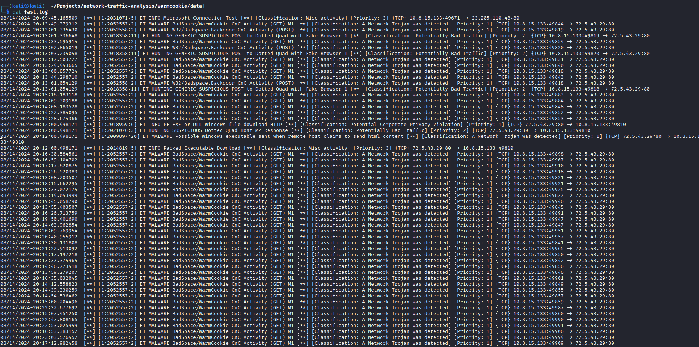
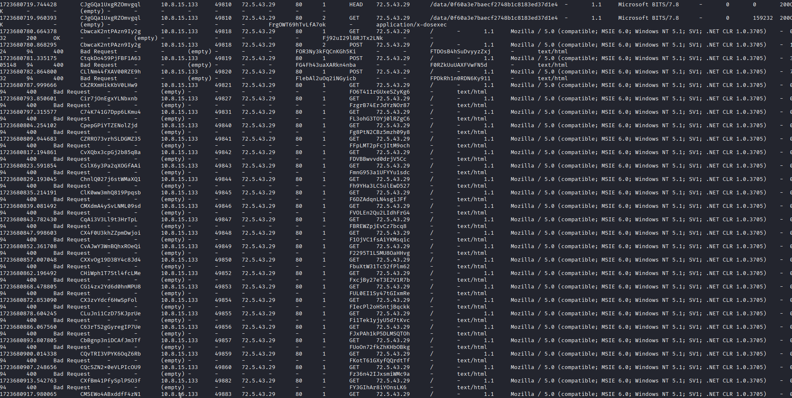
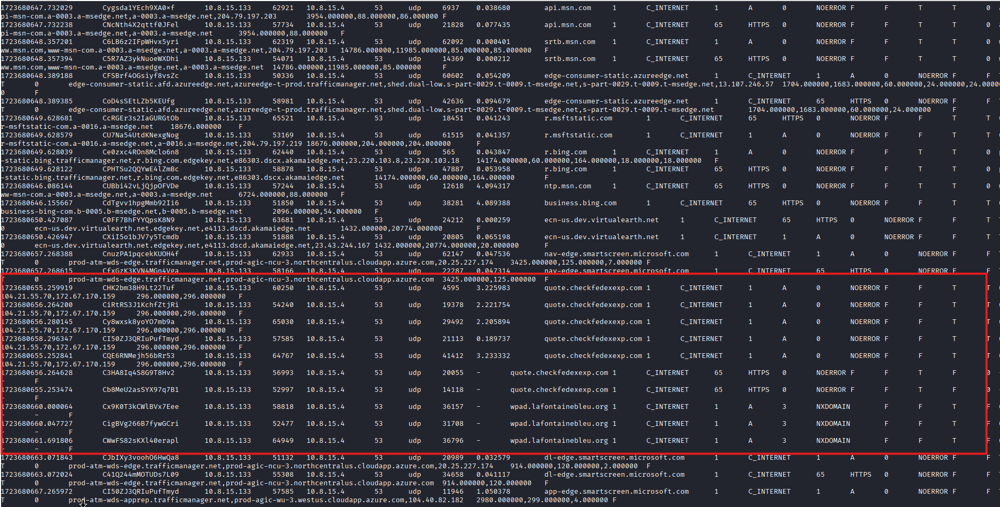
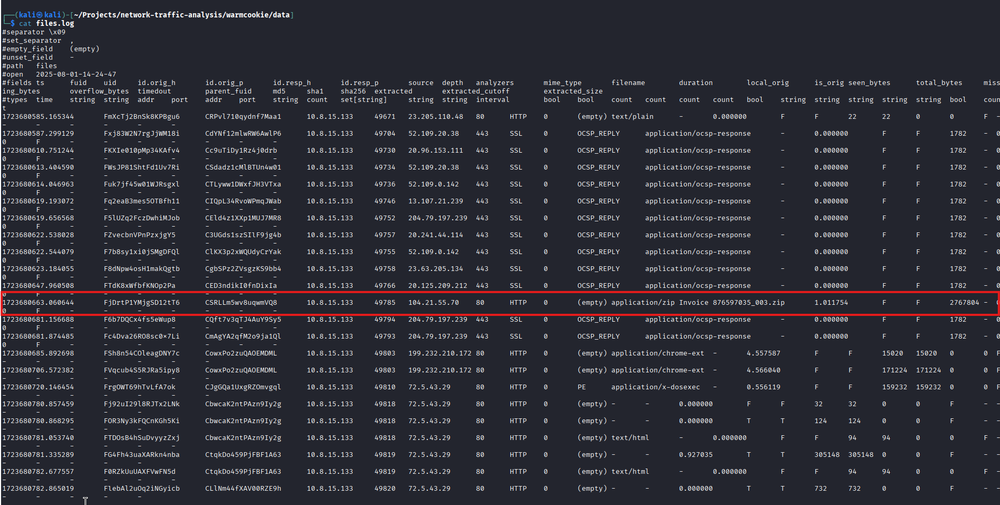
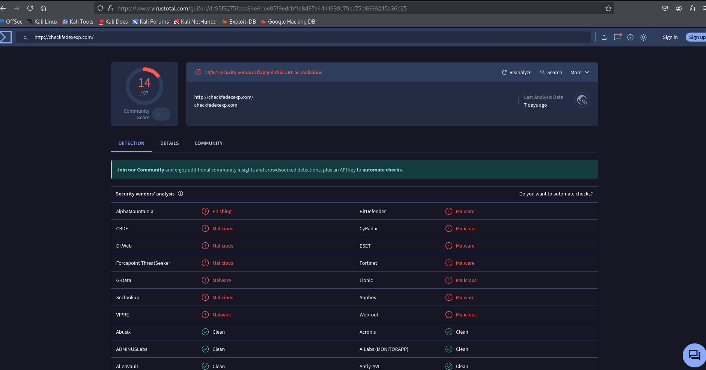
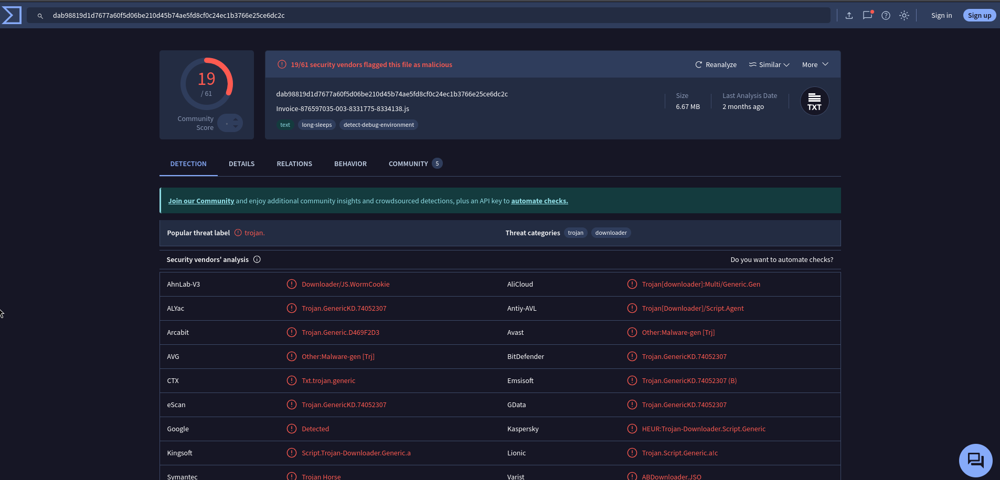

-- --
### Network Reports of Infected Device(s)

|Case ID|Report Title|Date of Report|Author|
|---|---|---|---|
|BMT100003|Network Analysis of WarmCookie Malware|August 1, 2025|Andrew McKenzie|

### 1. Executive Summary

On August 1, 2025, a network traffic analysis was performed on a captured PCAP file (`2024-08-15-traffic-analysis-exercise.pcap`). The analysis identified suspicious network activity originating from the host at **10.8.15.133**. The activity indicates an infection by the **WarmCookie** backdoor/trojan. The host was observed making numerous HTTP GET and POST requests to a command and control (C2) server located at **72.5.43.29** on port 80.

Suricata alerts classified this traffic as "ET MALWARE BadSpace/WarmCookie CnC Activity". Analysis of Zeek logs confirmed the C2 communication and revealed the initial infection vector: a malicious zip file named `Invoice 876597035_003.zip` downloaded from the domain `quote.checkfedexexp.com`. This zip file contained an obfuscated Javascript file, `Invoice-876597035-003-8331775-8334138.js`, which acted as a downloader for the main malware payload. This suggests the user was compromised via a phishing email and tricked into executing the script. Further forensic analysis of the host is necessary to understand the full extent of the compromise.

### 2. Detailed Timeline of Attack

- **Initial Analysis Commands**: The investigation began with the execution of Suricata and Zeek against the provided PCAP file to generate initial logs and alerts.
    
- **Malicious File Download**: Zeek's `files.log` shows the host **10.8.15.133** downloading a file named `Invoice 876597035_003.zip`.
    
- **WarmCookie C2 Beaconing**: Suricata generated numerous alerts for "ET MALWARE BadSpace/WarmCookie CnC Activity (GET)" and "ET MALWARE W32/Badspace.Backdoor CnC Activity (POST)" from **10.8.15.133** to the C2 server **72.5.43.29**.
    
- **Suspicious DNS Queries**: Zeek's `dns.log` shows the host making DNS queries for `quote.checkfedexexp.com`, which is the likely source of the malicious download.
    
- **Suspicious HTTP Traffic**: Zeek's `http.log` confirms repeated GET and POST requests from the infected host to the C2 server, characteristic of C2 beaconing and data exfiltration. The User-Agent used was `Mozilla / 5.0 (compatible; MSIE 6.0; Windows NT 5.1; SV1; .NET CLR 1.0.3705)`.
    

### 3. Technical Analysis & Key Findings

The investigation combined Suricata's intrusion detection alerts with Zeek's detailed network logs to analyze the suspicious activity.

#### 3.1. Command & Control (C2) Communication

The primary finding is the consistent C2 communication between the host **10.8.15.133** and the server **72.5.43.29**.

- **The Beacon**: Suricata consistently alerted on traffic to this IP as "ET MALWARE BadSpace/WarmCookie CnC Activity". This indicates the WarmCookie malware is installed and actively communicating.
    
- **The Channel**: Zeek logs confirm this traffic consists of HTTP GET and POST requests over port 80. The requests use a dated and suspicious User-Agent string, likely to evade simple detection.
    

#### 3.2. Payload and Persistence

- **Initial Vector**: The host **10.8.15.133** downloaded `Invoice 876597035_003.zip` from `quote.checkfedexexp.com`.
    
- **The Dropper**: The zip file contained a malicious, obfuscated Javascript file: `Invoice-876597035-003-8331775-8334138.js`. This script, when executed by the user, is designed to download the second-stage payload (the WarmCookie executable) from a remote server and run it.
    

This evidence points to the following infection chain:

1. User receives a phishing email with a link to `quote.checkfedexexp.com`.
    
2. User browses to the website and downloads `Invoice 876597035_003.zip`.
    
3. User opens the zip file and executes the malicious Javascript file inside.
    
4. The Javascript downloader fetches the WarmCookie executable from a threat actor-controlled server.
    
5. The WarmCookie malware is installed, establishing the C2 channel to **72.5.43.29**.
    

### 4. Indicators of Compromise (IOCs)

|Type|Indicator|Source|
|---|---|---|
|IP Address|**72.5.43.29**|C2 Server|
|Domain|`quote.checkfedexexp.com`|Malicious Download Host|
|File Name|`Invoice 876597035_003.zip`|Malicious Container|
|File Name|`Invoice-876597035-003-8331775-8334138.js`|Malicious Downloader Script|
|User-Agent|`Mozilla / 5.0 (compatible; MSIE 6.0; Windows NT 5.1; SV1; .NET CLR 1.0.3705)`|C2 Beacon|
|Suricata Alert|ET MALWARE BadSpace/WarmCookie CnC Activity|IDS Alert|

### 5. MITRE ATT&CK Framework Mapping

- **T1566.002** (Phishing: Spearphishing Link): The user likely clicked a link in a phishing email that led to the malicious domain.
    
- **T1204.002** (User Execution: Malicious File): The user executed the malicious Javascript file from the downloaded zip archive.
    
- **T1059.007** (Command and Scripting Interpreter: JavaScript): The attacker used a Javascript file to initiate the infection chain.
    
- **T1071.001** (Application Layer Protocol: Web Protocols): The C2 communication occurred over standard HTTP.
    
- **T1041** (Exfiltration Over C2 Channel): The POST requests suggest data was being exfiltrated from the compromised host.
    

### 6. Recommendations & Next Steps

#### Immediate Actions (Containment)

- **Isolate the Host:** Disconnect the machine at **10.8.15.133** from the network immediately.
    
- **Block Malicious IOCs:** At the network firewall, block all traffic to and from the C2 IP address **72.5.43.29** and the domain `quote.checkfedexexp.com`.
    
- **Preserve for Forensics**: Take a full forensic image of the host **10.8.15.133**. This is required to determine the extent of the compromise, what data was accessed or exfiltrated, and to identify persistence mechanisms.
    

#### Mid-Term Actions (Hardening & Detection)

- **Deploy IOCs:** Create detection rules in your security tools (SIEM, EDR, IDS) for the identified IP, domain, file names, and User-Agent.
    
- **Restrict Script Execution:** If possible, implement policies to prevent the execution of `.js` files directly from user-writable locations like the Downloads folder.
    
- **Review Email Security:** Analyze email logs for messages containing links to `quote.checkfedexexp.com` to identify other potential victims. Enhance email filtering to block similar threats.
    

#### Long-Term Actions (Strategic)

- **User Awareness Training:** Conduct security awareness training focused on identifying phishing emails and the dangers of downloading and opening attachments, especially `.zip` files containing scripts.
    

### Appendix: Supporting Evidence

#### Appendix A: Suricata Alerts (fast.log)

#### Appendix B: Zeek HTTP Logs (http.log)

#### Appendix C: Zeek Files and DNS Logs (files.log, dns.log)

#### Appendix D: VirusTotal Finding

